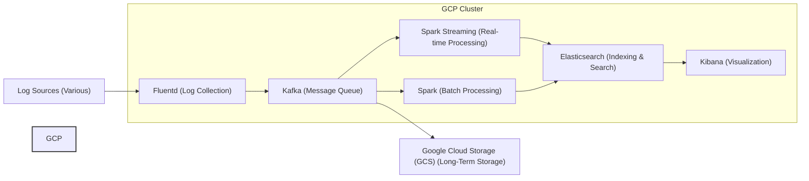

# Enterprise Log Analysis Pipeline on Google Cloud

## Description

A highly available and scalable log analysis pipeline designed for enterprise-level deployments on Google Cloud Platform (GCP). This pipeline ingests, processes, stores, and analyzes logs from various sources, providing valuable insights into system performance, security, and user behavior. The pipeline leverages Fluentd, Kafka, Spark, Elasticsearch, Kibana, and Google Cloud Storage (GCS) for a comprehensive solution.

## Architecture

The architecture consists of the following components:

*   **Log Sources:** Various systems and applications generating logs.
*   **Fluentd:** Collects logs from different sources and forwards them to Kafka.
*   **Kafka:** A distributed message queue that buffers and decouples the log ingestion layer from the processing layer.
*   **Spark Streaming:** Processes logs in real-time for immediate analysis.
*   **Spark:** Performs batch processing for historical log analysis.
*   **Elasticsearch:** Indexes and stores processed logs for efficient search and retrieval.
*   **Kibana:** Provides a user-friendly interface for visualizing and exploring log data.
*   **Google Cloud Storage (GCS):** Stores raw and processed logs for long-term archival.

## Setup

1.  Install Docker and Docker Compose.
2.  Clone this repository.
3.  Navigate to the project directory.
4.  Run `docker-compose up -d` to start the services.
5.  Configure Fluentd to collect logs from your desired sources.
6.  Access Kibana at `http://localhost:5601` to visualize the log data.
